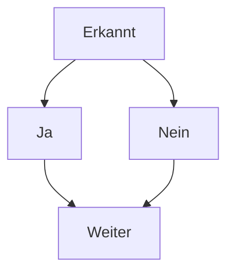

<div align=right>
    <a href="https://www.konrad-zuse-schule.de">
        
    </a>
</div>
<!--  -->
<!-- <span style="color:#CCCCCC">© Stiftung Jugend forscht e. V.</span> -->

# Projektplanung

> [!IMPORTANT]
> Der AR-Cube sowie alle Funktionen befinden sich derzeit noch in der Entwicklungsphase.
<!-- Pilotprojekt laufen derzeit an der ... -->
<!-- Sind Sie Schüler*in, Lehrer*in oder Direktor*in einer Schule in Deutschland? Bei Interesse an einer Pilotphase wenden Sie sich gerne an ... -->

**Bildung neu gedacht - AR-Würfel für Grundschulen und weiterführende Bildungseinrichtungen**

Ziel ist die Entwicklung eines python-basierten Programms, welches durch Zugriff auf die eingebaute Kamera einen Würfel anhand von ArUco Markern erkennt und auf dem Bildschirm 3D-Objekte auf den Würfel projeziert. Durch Drehung des Würfels können die Objekte von verschiedenen Seiten betrachtet werden. Zusätzlich können zum angezeigten Objekt indivudelle Sounds abgespielt und hilfreiche Informationen zum Lernen angezeigt werden.

> [!TIP]
> Der AR-Cube ist ein Non-Profit-Projekt der Konrad-Zuse-Schule Hünfeld.<br>


## Hintergrund

Jeder Schüler und jede Schülerin lernt auf eine andere Weise.
Manche bevorzugen es, Texte zu einem Thema zu lesen. Andere schauen sich
Videos an und wieder andere können sich mit Objekten besser vertraut machen,
wenn sie etwas anfassen können und eigene Erfahrungen sammeln können.

## Projektablauf

- [x] Aufgabe 1
- [ ] Aufgabe 2
- [ ] Aufgabe 3



# Einrichtung der Umgebung

Sollte `Python` auf dem Gerät nicht vorinstalliert sein, kann das Programm unter Linux mit dem folgenden Befehl installiert werden:
```
sudo apt-get update
sudo apt-get upgrade
sudo apt install python3
```
Für die vereinfachte Installation der Pakete installieren wir die Bibliothek `Pip`:
```
sudo apt-get install pip
```
> [!TIP]
> Im folgenden Schritt wird eine virtuelle Umgebung für Python verwendet. Dieser Schritt ist nicht zwingend notwendig, wird allerdings für eine korrekte Installation der Pakete empfohlen.

Anschließend installieren wir die virtuelle Umgebung `Venv` für Python und richten diese ein:
```
sudo apt install python3.12-venv
python3 -m venv venv
source venv/bin/activate
```

Im nächsten Schritt können wir die benötigten Bibliotheken `OpenCV-Contrib` und `Numpy` installieren:
```
pip install opencv-contrib-python numpy
```

## Projektablauf

Projekt-Ablauf:
Liste mit Bild-Pfaden der Würfelseiten
Größe Würfel (in Meter)
(Zu erzeugendes 3D-Objekt)

Programm starten
|
Würfel erkannt?
|
Eckpunkte/Ränder/ID erkennnen und einzeichnen
|
Bilder auf Würfelseiten projezieren
|
Drehung und Winkel berechnen
|
3D-Objekt basierend auf Drehung einzeichnen

## Auswertung und Ergebnisse

ArUco Marker werden zuverlässiger erkannt, wenn sie von einem weißen Rand
umgeben sind (Kontrast muss vorliegen). Mit einem schwarzen Hintergrund kann
der Marker nicht erkannt oder gelesen werden.

Die Zuverlässigkeit der Erkennung ist abhängig von der Auflösung der Kamera,
den vorliegenden Lichtverhältnissen, der Größe des Würfels und teils von der
Leistungsstärke des Geräts.

Die Messung und Erkennung ist bei optimal vorliegenden Bedingungen auf bis
zu 3 Meter zuverlässig.


<!-- 
> [!NOTE]
> Useful information that users should know, even when skimming content.

> [!TIP]
> Helpful advice for doing things better or more easily.

> [!IMPORTANT]
> Key information users need to know to achieve their goal.

> [!WARNING]
> Urgent info that needs immediate user attention to avoid problems.

> [!CAUTION]
> Advises about risks or negative outcomes of certain actions.

<h2>Weitere Links</h2>

<a href="https://docs.opencv.org/4.x/d0/d84/tutorial_js_usage.html">docs.opencv.org</a>
<a href="https://github.com/habbes/opencv-web-video">Github Web Video</a>
<a href="https://docs.opencv.org/4.x/js_video_display.html">OpenCV Video Chapture</a>
<a href="https://stackoverflow.com/questions/75615296/open-cv-js-to-access-webcam-and-show-output">Stackoverflow Webcame Integration</a>

<br>

<a href="https://pixabay.com/de/sound-effects/">Lizenzfreie Sounds</a>
<a href="https://pixabay.com/de/3d-models/">Lizenzfreie 3D-Objekte</a>

-->